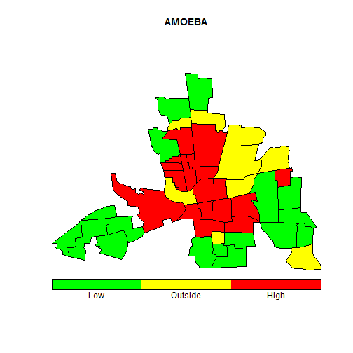
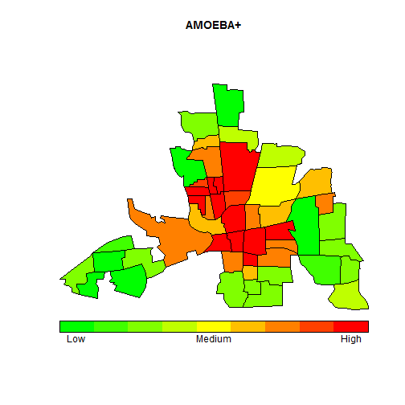

AMOEBA shiny App
===
author: Guillermo Valles Castellano
date: August, 2014
transition: rotate

Introduction
===

A Multidirectiona Optimum Ecotope-Based Algorithm is a function to calculate spatial clusters using the Getis-Ord local statistic. It searches irregular clusters (ecotopes) on a map through boundaries or grid of it.


How to use AMOEBA
===

You only need 5 arguments:


```r
AMOEBA(outc, neig, power = 1, cpu = 1)
```


- outc: Numeric vector with the study outcome
- neig: Neighbours object from "spdep" package
- power: Number of times to apply AMOEBA
- cpu: Total number of cpu to run faster the algorithm

You can make things like...
===


```
R Version:  R version 3.1.1 (2014-07-10) 
```

 

***

 

Information
===

- AMOEBA package available in R Cran

- Visit:
  - http://cran.r-project.org/web/packages/AMOEBA/index.html
  - http://amoeba-spatial-cluster.shinyapps.io/AMOEBA
  - http://github.com/amoeba-spatial-cluster/shinyApp
  
- Email: amoeba_spatial_cluster@yahoo.com
